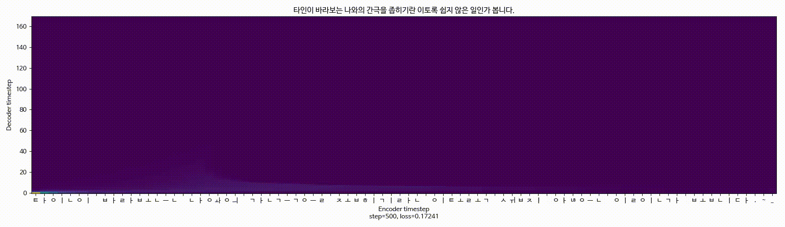

# Custom-Speech-Synthesis-Service-using-Multi-speaker-tacotron

Develop Custom Speech Synthesis Service using Deep learning (April 2019 – Sep 2019)  
We won an overwhelming first place in the competition (Electronic Engineering Creative Research Convergence Design), and won the grand prize (Sep, 2019)

<br/>  

## Additional Implementation from our team (Custom-Speech-Synthesis Service)

- Learning with data that includes Seok-Hee Son (News anchor), In-Na Yoo (Actress), Korean corpus, Ju-Hyung Lee (Team member), and Nan-Hee Kim (Team member)  

- Created web services([Demo video](https://nh9k.github.io/ml/Custom-Service.html)) using `flask` on the basis of [carpedm20/Multi-Speaker Tacotron in TensorFlow](https://github.com/carpedm20/multi-speaker-tacotron-tensorflow) through good model learning results, and its contents are `Basic synthesizer`, `Letter writing`, `Schedule briefing`, `Alarm service` 

- Called up `learned log(.ckpt)` with a `good speaker combination` and performed speech synthesis by `switching model` during the service

- The `learning` was done on the `Linux server`, and the `demonstration`([Demo video](https://nh9k.github.io/ml/Custom-Service.html)) was done on the `Windows server`

- To use for service, created phrase and composed BGM with synthesized voice using `librosa` and `pydub`

- This is the [source code](https://github.com/nh9k/Custom-Speech-Synthesis-Service-using-Multi-speaker-tacotron) of the computer that I demonstrated (`Windows system`)

<br/>  

## Helpful command

### Preparing datasets

#### Slice audio file with silence  

```
python3 -m audio.silence --audio_pattern "./datasets/yuinna/audio/*.wav" --method=pydub`
```
- Cut into silent sections and learned with matched lines for voice file.

#### Create a file : numpy, npz  

```
python3 -m datasets.generate_data ./datasets/son/alignment.json
```
- alignment means lines that matched audios.

#### Concatenate WAV file (Method: SoX v14.4.1)  
 
```
sox input1.wav input2.wav input3.wav output.wav
```
- you can also combine wav files using `FFMPEG`.

#### Remove noise (Method: SoX v14.4.1)  

```
sox input.wav -n noiseprof noise.prof
sox input.wav output.wav noisered noise.prof 0.21
```

<br/>  

### Training

#### Train a model  

```
python3 train.py --data_path ./datasets/yuinna,./datasets/kss,./datasets/nandong
```

#### Tensorboard  

```
tensorboard --logdir=logs\son+yuinna
```

<br/>  

### Synthesis audio & Demo sites

#### Synthesis  

```
python synthesizer.py --load_path logs/son+yuinna --text "반갑습니다" --num_speakers 2 --speaker_id 0
```
- id 0 is Seok-Hee Son.
- id 1 is In-Na Yoo.

#### APP (Demo Web page)  

```
python app.py --load_path logs/son+yuinna --num_speakers=2
```  


<br/>  

## Some issues
#### Librosa version problem
If you use a different version of librosa(0.6.2 or 0.6.3), learning can stop after 500 steps.  
Fix it with the following source code. (the file:`audio/__init__.py`)  
- Learning (Linux server, Librosa 0.6.2, 0.6.3)
```
#librosa 0.6.2, 0.6.3
def save_audio(audio, path, sample_rate=None):
    #audio *= 32767 / max(0.01, np.max(np.abs(audio)))
    librosa.output.write_wav(path, audio, #.astype(np.int16)
            hparams.sample_rate if sample_rate is None else sample_rate)

    print(" [*] Audio saved: {}".format(path))
```

- Demo (Window server, Librosa 0.5.1)
```
#librosa 0.5.1
def save_audio(audio, path, sample_rate=None):
    audio *= 32767 / max(0.01, np.max(np.abs(audio)))
    librosa.output.write_wav(path, audio.astype(np.int16),
            hparams.sample_rate if sample_rate is None else sample_rate)

    print(" [*] Audio saved: {}".format(path))
```

<br/> 

#### Good combination of speaker  

- Model name (speaker)
    - son (Seok-Hee Son)  
    - yuinna (In-Na Yoo)  
    - new_inna (In-Na Yoo, version2) 
    - nandong (Nan-Hee Kim, team member) 
    - nandong2 (Nan-Hee Kim, team member, version 2)  
    - LEEJH (Ju-Hyung Lee, team member)  
    - kss (Korean corpus)  
    - hozzi (Ho-Yeon Kim, team member)
    
- About speaker
    - version2 is the results We've gone through more screening about lines with speech.
    - hozzi was unable to use because of poor learning results.
    - Son is the datasets of Newroom
        - 43700 lines / 11 hours
        - using `Google Cloud STT API` + handmade
    - new_inna is the datasets of audiobook
        - 3670 lines / 5 hours
        - handmade
    - kss is the provided datasets 
        - 12800 lines / 3 hours
    - LEEJH & nandong2
        - 2930 lines / 3 hours
        - recorded `The Old Man and the Sea` in a quiet environment  
        - handmade
    - hozzi
        - 550 lines / an hour
        - handmade

- Experiments
    - son + yuinna
    - son + yuinna + hozzi
    - son + hozzi
    - yuinna + kss
    - new_inna + kss + LEEJH
    - new_inna + kss + LEEJH + nandong
    - new_inna + kss + nandong2
    - new_inna + kss + LEEJH + nandong2  
    
- Best combination  
    - son + yuinna
        - son was the best result.
        - yuinna was the worst result.
    - new_inna + kss + LEEJH
        - new_inna, kss, LEEJH were the best results.
    - new_inna + kss + LEEJH + nandong2
        - nandong2 was the best results.

<br/>  

## Prerequisites

There is a difference from [the original model github version](https://github.com/carpedm20/multi-speaker-tacotron-tensorflow/blob/master/requirements.txt).  
You can refer to [our version](https://github.com/nh9k/Custom-Speech-Synthesis-Service-using-Multi-speaker-tacotron/blob/master/requirements_ours.txt).

<br/>  

## Model

If you want to model-learning, you can refer to original source code here.  

- [Multi-speaker-tacotron model](https://github.com/carpedm20/multi-speaker-tacotron-tensorflow)     

<br/>  

## Project demo & Presentation
[Demo video & PPT](https://nh9k.github.io/ml/Custom-Service.html)

<br/>  

## Real demo web page & Source Code  

I am reviewing the real demo web page part that can be provided without any problems.  
[Source code](https://github.com/nh9k/Custom-Speech-Synthesis-Service-using-Multi-speaker-tacotron)

<br/>  

## References
Thank you so much,  
- [Multi-speaker-tacotron-tensorflow](https://github.com/carpedm20/multi-speaker-tacotron-tensorflow) / carpedm20      
- [딥러닝 음성합성 multi-speaker-tacotron(tacotron+deepvoice)설치 및 사용법](http://nblog.syszone.co.kr/archives/9416) / 서진우 님    
- [인공지능 deep voice를 이용한 TTS(음성합성) 구현하기 _ 손석희 앵커](http://melonicedlatte.com/machinelearning/2018/07/02/215933.html) / melonicedlatte     
- Older friend Hyun Kim from [Power Supply Robot Club](https://nh9k.github.io/control/PowerSupply-Robot-Club.html)   

<br/>  

## Team members
We've been through the `whole process together`, but main role is...   
[Nanhee Kim](https://github.com/nh9k) / [@nh9k](https://github.com/nh9k) / [nh9k blog](https://blog.naver.com/kimnanhee97) : Learning and Making Web Service, Provided main idea   
[Hoyeon Kim](https://github.com/mozzihozzi): To use for service, created phrase and composed BGM with synthesized voice, team leader   
[Juhyung Lee](https://github.com/darpa776): Got a good custom datasets, and selection     
  
<br/>  
<br/>
<br/>
<br/>
<br/>

 
### Main Page Information of Multi-Speaker-Tacotron >>>
# Multi-Speaker Tacotron in TensorFlow

TensorFlow implementation of:

- [Deep Voice 2: Multi-Speaker Neural Text-to-Speech](https://arxiv.org/abs/1705.08947)
- [Listening while Speaking: Speech Chain by Deep Learning](https://arxiv.org/abs/1707.04879)
- [Tacotron: Towards End-to-End Speech Synthesis](https://arxiv.org/abs/1703.10135)

Samples audios (in Korean) can be found [here](http://carpedm20.github.io/tacotron/en.html).


## Prerequisites

- Python 3.6+
- FFmpeg
- [Tensorflow 1.3](https://www.tensorflow.org/install/)


## Usage

### 1. Install prerequisites

After preparing [Tensorflow](https://www.tensorflow.org/install/), install prerequisites with:

    pip3 install -r requirements.txt
    python -c "import nltk; nltk.download('punkt')"

If you want to synthesize a speech in Korean dicrectly, follow [2-3. Download pre-trained models](#2-3-download-pre-trained-models).


### 2-1. Generate custom datasets

The `datasets` directory should look like:

    datasets
    ├── son
    │   ├── alignment.json
    │   └── audio
    │       ├── 1.mp3
    │       ├── 2.mp3
    │       ├── 3.mp3
    │       └── ...
    └── YOUR_DATASET
        ├── alignment.json
        └── audio
            ├── 1.mp3
            ├── 2.mp3
            ├── 3.mp3
            └── ...

and `YOUR_DATASET/alignment.json` should look like:

    {
        "./datasets/YOUR_DATASET/audio/001.mp3": "My name is Taehoon Kim.",
        "./datasets/YOUR_DATASET/audio/002.mp3": "The buses aren't the problem.",
        "./datasets/YOUR_DATASET/audio/003.mp3": "They have discovered a new particle.",
    }

After you prepare as described, you should genearte preprocessed data with:

    python3 -m datasets.generate_data ./datasets/YOUR_DATASET/alignment.json


### 2-2. Generate Korean datasets

Follow below commands. (explain with `son` dataset)

0. To automate an alignment between sounds and texts, prepare `GOOGLE_APPLICATION_CREDENTIALS` to use [Google Speech Recognition API](https://cloud.google.com/speech/). To get credentials, read [this](https://developers.google.com/identity/protocols/application-default-credentials).

       export GOOGLE_APPLICATION_CREDENTIALS="YOUR-GOOGLE.CREDENTIALS.json"

1. Download speech(or video) and text.

       python3 -m datasets.son.download

2. Segment all audios on silence.

       python3 -m audio.silence --audio_pattern "./datasets/son/audio/*.wav" --method=pydub

3. By using [Google Speech Recognition API](https://cloud.google.com/speech/), we predict sentences for all segmented audios.

       python3 -m recognition.google --audio_pattern "./datasets/son/audio/*.*.wav"

4. By comparing original text and recognised text, save `audio<->text` pair information into `./datasets/son/alignment.json`.

       python3 -m recognition.alignment --recognition_path "./datasets/son/recognition.json" --score_threshold=0.5

5. Finally, generated numpy files which will be used in training.

       python3 -m datasets.generate_data ./datasets/son/alignment.json

Because the automatic generation is extremely naive, the dataset is noisy. However, if you have enough datasets (20+ hours with random initialization or 5+ hours with pretrained model initialization), you can expect an acceptable quality of audio synthesis.

### 2-3. Generate English datasets

1. Download speech dataset at https://keithito.com/LJ-Speech-Dataset/

2. Convert metadata CSV file to json file. (arguments are available for changing preferences)
		
		python3 -m datasets.LJSpeech_1_0.prepare

3. Finally, generate numpy files which will be used in training.
		
		python3 -m datasets.generate_data ./datasets/LJSpeech_1_0
		

### 3. Train a model

The important hyperparameters for a models are defined in `hparams.py`.

(**Change `cleaners` in `hparams.py` from `korean_cleaners` to `english_cleaners` to train with English dataset**)

To train a single-speaker model:

    python3 train.py --data_path=datasets/son
    python3 train.py --data_path=datasets/son --initialize_path=PATH_TO_CHECKPOINT

To train a multi-speaker model:

    # after change `model_type` in `hparams.py` to `deepvoice` or `simple`
    python3 train.py --data_path=datasets/son1,datasets/son2

To restart a training from previous experiments such as `logs/son-20171015`:

    python3 train.py --data_path=datasets/son --load_path logs/son-20171015

If you don't have good and enough (10+ hours) dataset, it would be better to use `--initialize_path` to use a well-trained model as initial parameters.


### 4. Synthesize audio

You can train your own models with:

    python3 app.py --load_path logs/son-20171015 --num_speakers=1

or generate audio directly with:

    python3 synthesizer.py --load_path logs/son-20171015 --text "이거 실화냐?"
	
### 4-1. Synthesizing non-korean(english) audio

For generating non-korean audio, you must set the argument --is_korean False.
		
	python3 app.py --load_path logs/LJSpeech_1_0-20180108 --num_speakers=1 --is_korean=False
	python3 synthesizer.py --load_path logs/LJSpeech_1_0-20180108 --text="Winter is coming." --is_korean=False

## Results

Training attention on single speaker model:



Training attention on multi speaker model:


## Disclaimer

This is not an official [DEVSISTERS](http://devsisters.com/) product. This project is not responsible for misuse or for any damage that you may cause. You agree that you use this software at your own risk.


## References

- [Keith Ito](https://github.com/keithito)'s [tacotron](https://github.com/keithito/tacotron)
- [DEVIEW 2017 presentation](https://www.slideshare.net/carpedm20/deview-2017-80824162)


## Author

Taehoon Kim / [@carpedm20](http://carpedm20.github.io/)


